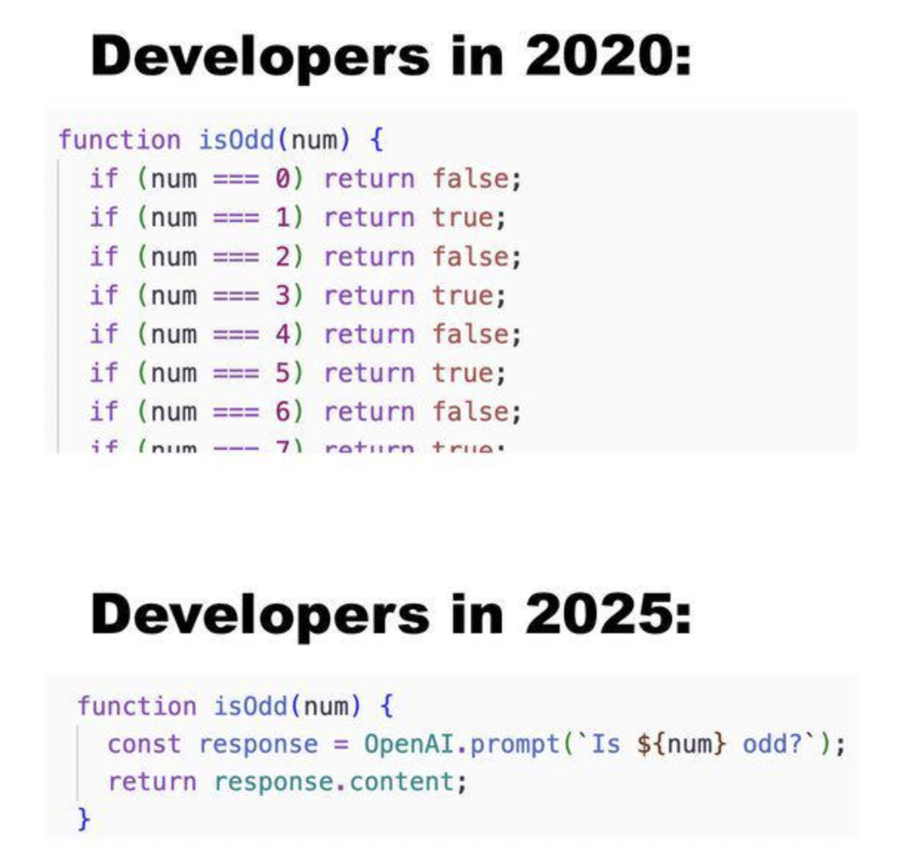

# Cursed decorator to vibe Python on the fly

Are you tired of asking an LLM for some code and then having to **wait** to run it? I know I am. But now we can do better! With this cursed decorator you can vibe Python on the fly! Just define an empty function with a descriptive name and decorate it with `@ai_implement`, and OpenAI will implement it during runtime!

**Before:**

> Please Mr. GPT, implement for me a Python function called `check_if_number_is_prime`. 🥺

**After:**

```python
from cursed_vibing_on_the_fly import ai_implement

@ai_implement
def check_if_number_is_prime(n):
    pass
```

After this, any time you use the `check_if_number_is_prime` function, the decorator will automatically ask `gpt-5-mini` to implement a function of this name and then run it on the fly.

The system can even include docstrings or pydantic type annotations if you want that fine extra control!

```python
from typing import Union
from cursed_vibing_on_the_fly import ai_implement

@ai_implement
def round_float(number):
    """Rounds a given float to the nearest integer."""
    pass


@ai_implement
def check_if_string_equals_number(string_input: str, comparison_number: Union[float, int]) -> bool:
    """
    This function tries to parse a string into a float or int and then see if the value equals `comparison_number`.
    """
    pass
```

For a mockery of replicability, the system can be set to cache the LLM-invocations for function persistency between calls (in-memory only — lost on restart). As boring as that is.

## Quickstart

Don't. Quickly or at all. **This really does run `exec` on raw LLM output on your machine.** But if you must:

### Prerequisites

* [uv](https://github.com/astral-sh/uv) installed.
* `OPENAI_API_KEY` environment variable set.

### Installation & Usage

1. Clone the repository:

   ```bash
   git clone <repo-url>
   cd cursed_vibing_on_the_fly
   ```

2. Sync dependencies:

   ```bash
   uv sync
   ```

3. Run the demo:

   ```bash
   uv run examples/demo.py
   ```

4. Run tests:

   ```bash
   # Run safe tests (mocked)
   uv run pytest

   # Run dangerous tests (real API calls)
   uv run pytest -m dangerous
   ```

5. Run without cache, i.e.\ every function call calls LLM:

   ```bash
   CURSED_VIBING_CACHE_ENABLED=false uv run examples/demo.py
   ```

### Configuration

You can control behavior with environment variables:

* `OPENAI_API_KEY`: Required for API access.
* `CURSED_VIBING_CACHE_ENABLED`: Set to `true` to enable caching (default: `false`). When disabled, the LLM is called on **every function execution**.
* `AI_IMPLEMENT_RETRY_LIMIT`: Number of retries on generation failure (default: 3).

## How it works

When you decorate a function with `@ai_implement`, the following happens:

1. **Inspection**: The decorator inspects your function stub. It gathers:
    * The function name (very important!).
    * The docstring (if provided).
    * Type hints (including Pydantic models and `Annotated` descriptions).
    * Parameter names and default values.

2. **Lazy Generation**: The actual request to the LLM is **NOT** made when you import the module or define the function. It happens only **when you call the function**. This keeps the code feel much more alive and vibrant.

3. **Prompt Construction**: The metadata is compiled into a system prompt that asks an LLM (GPT-5-mini by default) to implement the function body.

4. **Generation & Execution**:
    * The LLM returns Python code.
    * The code is cleaned (markdown stripped).
    * **DANGER**: The code is executed using `exec()` in a local namespace containing the necessary type definitions.
    * There are `AI_IMPLEMENT_RETRY_LIMIT` retries for getting the function not throw a syntax error.

5. **Caching**: If `CURSED_VIBING_CACHE_ENABLED` is `True`, the compiled function is cached in memory.
    * **Subsequent calls** to the function then use the cached implementation immediately.
    * If you restart the script, the cache is lost and the LLM will be called again, regardless of `CURSED_VIBING_CACHE_ENABLED`.

## Why?

A colleague shared the following meme:



([source](https://www.reddit.com/r/AICompanions/comments/1ph8w96/developers_in_2020/)) in a chat and I thought that surely as an Agent Developer I can do better than that.

## TODO

1. It seem very inefficient that a failed parsing of a function leads to a vanilla retry call. We should have a more complex retry logic where we continue the discussion with the LLM, giving it the syntax errors as context.
2. A more flexible LLM-integration supporting also local models would be great!
3. Not sure if this would actua
